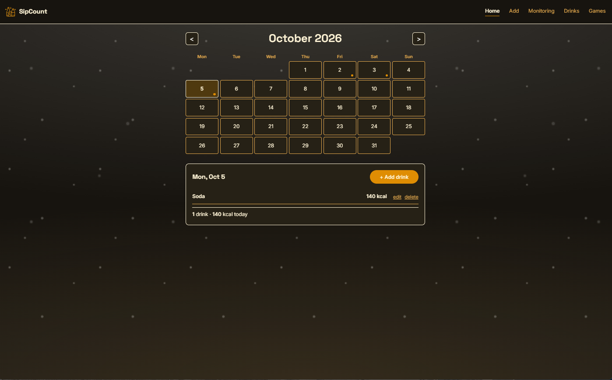
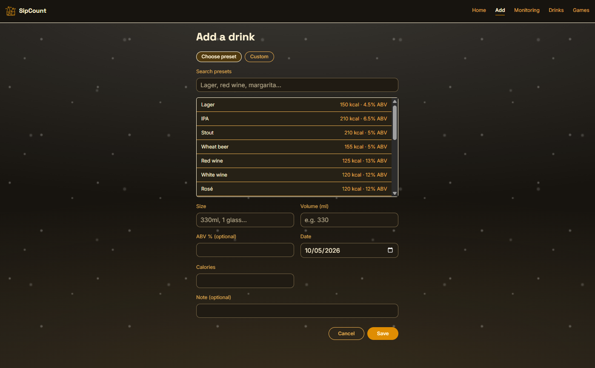
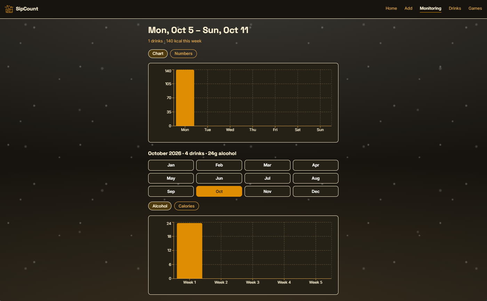
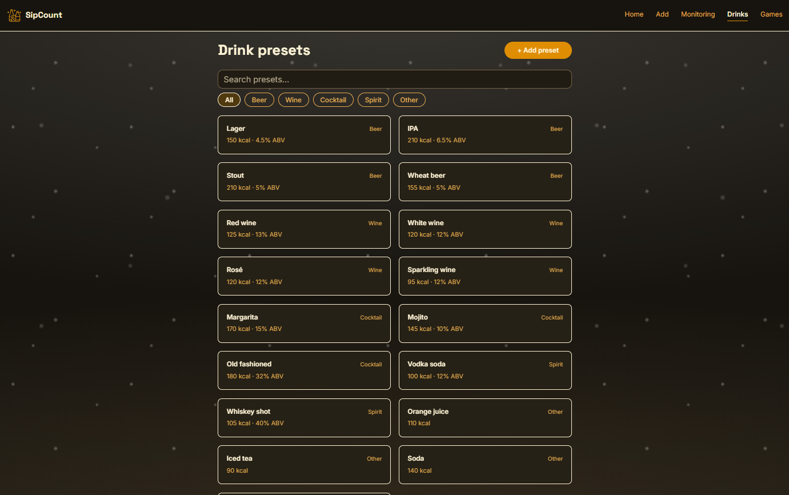
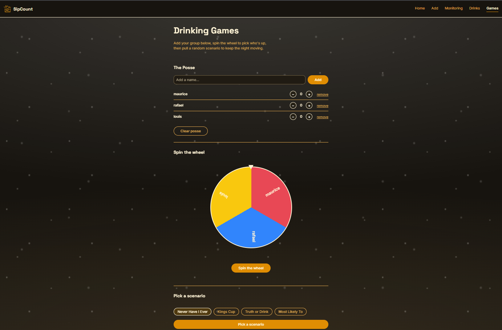

# SipCount

[](AI-USAGE.md)

## Overview

SipCount is a small app for logging drinks, both alcoholic and
non-alcoholic. It lets a single user log a drink in a few taps and see
roughly how many calories it has. It also lets the user check how their
week is going, in total drinks and total calories. It is for people who
drink socially or moderately and want a faster way to track this than a
general calorie app.

**Live site:**  

https://sipcount.onrender.com/login - Live Site (app may take up to a minute to wake up on its free-tier server)

https://drive.google.com/drive/folders/1YZnmqiAUTF5H0yxxc_XkoBmT11S4qMPu?usp=sharing - Video Demo, PPT, SquareImage, etc.



## Setup and installation

**What to install first**

- [Node.js](https://nodejs.org) version 18 or newer (this also installs
  npm).
- A code editor, for example [VS Code](https://code.visualstudio.com).
- A free [Supabase](https://supabase.com) account, for the database.

**How to get the code**

```
git clone https://github.com/gabluigi/SipCount-Project.git
cd SipCount-Project
```

The React app lives inside `client/`. The small password-gate server
lives inside `server/`. The commands below are run from the repository
root unless noted otherwise.

**How to install dependencies**

Run this from the repository root (the folder containing `client/` and
`server/`):

```
npm --prefix client install
npm --prefix server install
```

The client install brings in React, `react-router-dom` (for the five
screens), `recharts` (for the charts on the Monitoring screen), and
`@supabase/supabase-js` (to connect to the database). The server install
brings in Express, `cookie-parser`, and `dotenv` — just enough to run the
password gate in front of the built app.

**Database setup**

SipCount uses [Supabase](https://supabase.com) (a hosted PostgreSQL
database) for persistent storage.

1. Create a free project at supabase.com.
2. Open the SQL Editor and run the schema script in
   `client/supabase-schema.sql`. This creates the `entries`, `presets`, and
   `posse` tables, enables Row Level Security on each, and fills in the
   built-in drink presets.
3. Go to **Settings > API Keys** and copy your **Project URL** and your
   **Publishable key** (`sb_publishable_...`). Use the new key system, not
   the older `anon` key, since Supabase is phasing that one out.

**Environment and configuration**

Copy `.env.example` to `.env` in the repository root and fill in your own
values. One `.env` file covers both the client build and the password
gate server:

| Name | What it is |
| --- | --- |
| `VITE_SUPABASE_URL` | Your Supabase project's base URL, for example `https://your-project-ref.supabase.co` (no extra path after `.co`) |
| `VITE_SUPABASE_PUBLISHABLE_KEY` | Your project's publishable key from Settings > API Keys |
| `SITE_PASSWORD` | The password someone must enter before the app loads |
| `COOKIE_SECRET` | A long random string used to sign the login cookie — not something anyone types, just needs to be unpredictable |

Vite is configured to load environment variables from the repository
root (`envDir: '..'` in `client/vite.config.js`), and only reads the
`VITE_`-prefixed ones into the built app — `SITE_PASSWORD` and
`COOKIE_SECRET` never reach the browser. The server reads the same root
`.env` file directly via `dotenv`. `.env` is never committed; only
`.env.example`, with placeholder values, is kept in the repository.

## How to run it

**For day-to-day development** (fast reload, but no password gate — this
is Vite's own dev server, separate from the gate):

```
npm --prefix client run dev
```

Then open the address shown in the terminal, usually
`http://localhost:5173`.

**To run it the way it actually runs in production**, with the password
gate in front:

```
npm --prefix client run build
node server/server.js
```

Then open `http://localhost:3000`. You should be asked for the password
before the app loads — enter the `SITE_PASSWORD` value from your `.env`
file.

When it works, you should see the Home screen: a month calendar, with
today's date marked, and a panel below it showing that day's logged
drinks. If you already added presets through the SQL script, the Drinks
screen should also show them right away.

## Features and usage

**Home (`/`)**
Shows a month calendar. Days with logged drinks are marked. Tapping a day
opens a panel below the calendar with that day's entries, each entry's
note, and a running total. Each entry (including its note) can be edited
or deleted right there, inline. A "+ Add drink" button opens the Add
screen, already set to the day you picked.

**Add (`/add`)**
A form to log a new drink. You can either search and pick a drink from
the presets, or switch to "Custom" and type your own. Fields include
size, volume in millilitres, ABV (optional), date, and an optional note.
Calories fill in automatically when you pick a preset, but you can always
change the number by hand. Saving writes the entry to Supabase and
returns you to Home, with the new entry visible.

**Monitoring (`/history`)**
Shows the current week's totals (drinks and calories), with a chart or
plain-numbers toggle for the day-by-day breakdown. Below that, a 12-tile
month picker shows a week-by-week breakdown for whichever month you
select, with a toggle between total calories and grams of alcohol
(calculated from volume × ABV, not just raw ABV percentage).

**Drinks (`/drinks`)**
A list of preset drinks (beer, wine, cocktails/spirits, and other drinks
like juice or soda), with calorie and ABV estimates. You can search and
filter by category. You can also add your own custom presets, and edit
or delete the ones you added. Built-in presets cannot be edited or
deleted.

**Games (`/games`)**
A lighthearted extra page, not part of the core tracking: add people to a
"posse" list with an individual drink counter, spin a wheel to randomly
pick someone from that list, and pull a random prompt from four
categories (Never Have I Ever, Kings Cup, Truth or Drink, Most Likely
To). The posse list is saved to Supabase; the prompts themselves are
hardcoded in the app, not stored in the database.

Once past the password gate, the React app talks directly to Supabase's
built-in API, using the publishable key and the Row Level Security
policies set on each table. The gate server does not sit between the app
and Supabase — it only controls whether the app's files are served at
all.

## Project structure

```
SipCount-Project/
├── README.md
├── SECURITY-CHECKLIST.md   audit of secrets, access control, and data handling
├── AI-USAGE.md             record of how AI assistance was used
├── .env.example            one shared template for client + server variables
├── client/                 the SipCount React app
│   ├── index.html
│   ├── package.json
│   ├── supabase-schema.sql   run once in the Supabase SQL Editor to set up
│   │                         the entries, presets, and posse tables + RLS
│   └── src/
│       ├── main.jsx
│       ├── App.jsx           routes and providers
│       ├── tokens.css        design system tokens (color, type, spacing)
│       ├── lib/
│       │   ├── supabaseClient.js   connects to Supabase
│       │   ├── entriesRepo.js      Supabase calls for drink entries
│       │   ├── presetsRepo.js      Supabase calls for drink presets
│       │   └── posseRepo.js        Supabase calls for the Games posse list
│       ├── context/           shared React state: entries, presets, posse
│       │                      (each calls its matching repo file above)
│       ├── data/               category list for Drinks, and the hardcoded
│       │                      scenario prompts for Games
│       ├── utils/              date helpers and the alcohol-grams formula
│       ├── components/
│       │   ├── atoms/          e.g. Button
│       │   ├── molecules/      e.g. EntryRow, TogglePill, PosseRow
│       │   └── organisms/      e.g. NavBar, CalendarGrid, SpinWheel,
│       │                      ScenarioPicker
│       └── pages/              Home, Add, Monitoring, Drinks, Games
├── server/                 the password-gate server (see note below)
│   ├── package.json
│   ├── server.js            Express: checks the password, sets a signed
│   │                        cookie, then serves client/dist
│   └── public/
│       └── login.html        the password screen itself (plain HTML, no
│                              build step, styled to match tokens.css)
└── docs/                    planning documents, weekly reports, screenshots
```

**A note on the `server/` folder:** this is not a backend API for the
app's data — SipCount still talks to Supabase directly from the browser
for every drink, preset, and posse entry. `server/` exists for one
narrow job: nobody can load the app's files at all without the right
password first. Once past it, the server gets out of the way entirely.

## Screenshots

### Home


### Add



### Monitoring



### Drinks



### Games



## Architecture

Two pieces, hosted together on the same Render Web Service, doing
different jobs. **`server/`** is a small Express process that checks a
password against an environment variable, and only then serves the
already-built **`client/`** React app as static files — this is what
makes the whole site require a login before anything loads. Once the
browser has that app, it talks **directly to Supabase** for every read
and write (entries, presets, posse) — the Express server is never in
that path, it only gated the initial page load. Supabase's own Row Level
Security policies, not the Express server, are what protect the actual
data once someone is past the login screen.

## What I would do next

- **Rewrite history to remove the old hardcoded password.** An earlier
  version of the login gate had a password hardcoded directly in source;
  the file is deleted now, but `git log -p` still finds it in an old
  commit. Rewriting history to actually scrub it is the next real step,
  rather than just leaving it as a documented known issue. I hardcoded in 
  the first place because of initial time constraints
- **Add a "remember me" expiry that's actually configurable**, instead of
  the fixed 24-hour cookie — useful for a longer grading window without
  loosening security for everyday use.
- **Investigate unexpected bug fix**, study how the old "mobile refresh returns 
  404" bug from earlier testing is now fixed as a side effect of the new server's 
  catch-all route, which serves `index.html` for any unmatched path — so a hard 
  refresh on `/history` or `/games` works correctly now.

## Author

Louis Gabriel Malig 2215-6APSI CS403

## AI use


This project was built with Claude as an AI development assistant. Claude was used heavily for the frontend, including UI design, page structure, styling, animations, and feature implementation. I was mainly responsible for the backend and data layer, including designing the Supabase database schema, Row Level Security (RLS) policies, and the main database logic. I also reviewed, changed, and tested AI-generated code when needed.

For the full record of how AI was used, what was kept or changed, and where the AI made mistakes, see [AI-USAGE.md](AI-USAGE.md).

## Licence

MIT, see [LICENSE](LICENSE.txt).
