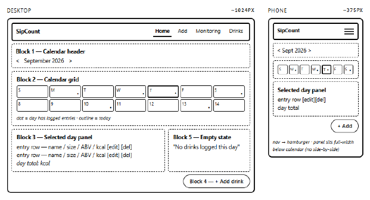
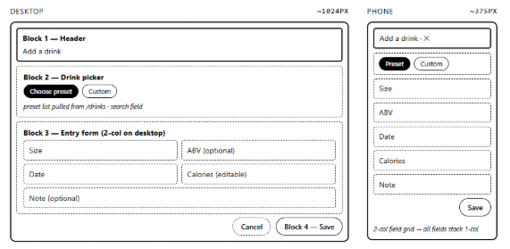
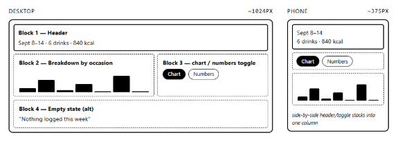
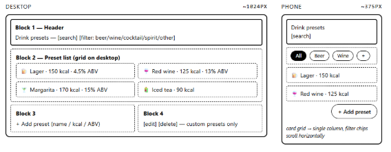
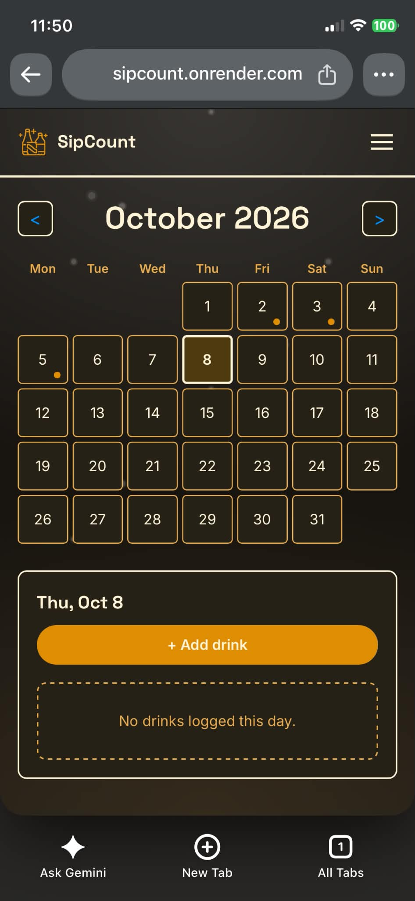

# Mockup

The images below are screenshots of the **wireframe**, uploaded in prelims
(files in `docs/assets/`). They show the initial mockup plan of the app.

Whereas the screenshots of the actual app (files in `docs/screenshots/`) 
show the real colours, type, spacing and the final content.

## Screens

SipCount originally had four screen, here is the following:

### Home (`/`)

Month calendar with a dot on days that have drinks. The panel below shows
the selected day: each entry with its calories, edit and delete links, and
a total (for example "1 drink · 140 kcal today").

### Add (`/add`)

Form for a new drink: preset or custom, size, volume, ABV, calories, date
and note.

### Monitoring (`/history`)

Current-week chart with a Chart / Numbers toggle. Below it, 12 month tiles
and a week-by-week chart for the selected month, switchable between
alcohol (grams) and calories.

### Drinks (`/drinks`)

Preset list with search and category filter, and a form for custom presets.

### Games (`/games`) and Password screen

Both of these pages were added later on during the development of this app, and 
therefore does not have a mockup / wireframe.

## Empty states

Each of these is the same dashed-border box with one line of text:

| Screen | Text shown |
| --- | --- |
| Home (a day with no drinks) | "No drinks logged this day." |
| Monitoring (week) | "Nothing logged this week." |
| Monitoring (month) | "Nothing logged in {month}." |
| Drinks (search with no match) | "No presets match your search." |
| Games (no people added) | "No one in the posse yet." |

## Phone

The layout changes below 640px wide (the navigation collapses to a
hamburger menu, and the edit grid and other layouts adjust). 

Mobile Responsiveness Sample:

## Honest note: what changed from the plan

The first plan (weekly report of 2026-09-22) had four screens: Home, Add,
Monitoring and Drinks. These were added later and were **not** in the
original wireframes:

- The Games screen (2026-10-04).
- The month picker and monthly chart on Monitoring (2026-10-03).
- The alcohol (grams) view on Monitoring (2026-10-03).
- The password screen (2026-10-04 as a client-side screen, replaced by a
  server-side one on 2026-10-07).
- The animated background and the dark appearance (both 2026-10-04).

