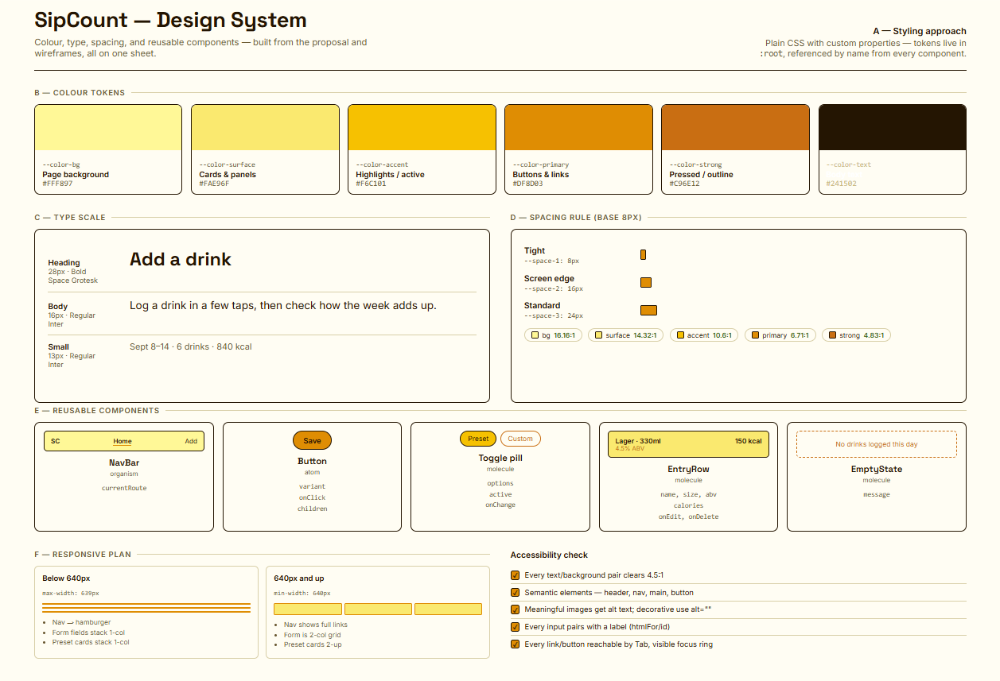

# Design system

The rules the interface follows, as they exist in the code today. All
values come from `client/src/tokens.css` and the component CSS files.

**Visual document:** 

shows every colour token, buttons, fonts, etc

## Colour

| Code name | Dark | Used for |
| --- | --- | --- |
| `--color-bg` | `#17140F` | Page background |
| `--color-surface` | `#262116` | Cards and panels |
| `--color-accent` | `#4F390F` | Selected pill, selected calendar day, hovered month tile |
| `--color-primary` | `#DF8D03` | Primary button background |
| `--color-strong` | `#E8AC4E` | Borders, secondary text, links |
| `--color-text` | `#FFF4D6` | Body text |
| `--field-bg` | `#201B13` | Input background |
| `--field-border` | `#746344` | Input border |
| `--field-placeholder` | `#B9AC8D` | Placeholder text |
| `--field-focus` | `#F6BD4F` | Input focus ring |

Known failures, not yet fixed:

- Light mode: secondary text, empty-state text and ghost-button text use
  `--color-strong` and fall below 4.5.
- Dark mode: primary buttons put `--color-text` (a light cream) on
  `--color-primary` (orange), at 2.41.
- The password screen button uses white text on orange in both modes, at 2.64.

## Type

Fonts are loaded from Google Fonts in `client/index.html`.

| Token | Size | Family and weight | Used for |
| --- | --- | --- | --- |
| `--font-size-lg` | 28px | Space Grotesk (500, 600, 700 loaded) | Headings (`h1`, `h2`, `h3`) |
| `--font-size-md` | 16px | Inter (400, 500, 600 loaded) | Body text |
| `--font-size-sm` | 13px | Inter | Buttons, labels, small text |

Body line height is 1.5.

## Spacing

One scale, base unit 8px.

| Token | Value | Used for |
| --- | --- | --- |
| `--space-1` | 8px | Between related items |
| `--space-2` | 16px | Screen edge padding |
| `--space-3` | 24px | Between sections |

The phone layout applies below 640px wide; 640px and up is the desktop layout.

## Components

| Component | Normal | Hover | Focused | Disabled | Loading |
| --- | --- | --- | --- | --- | --- |
| Button, primary (`.btn-primary`) | Orange fill, rounded (20px) | Opacity 0.9 | 2px outline in `--color-strong`, 2px offset | Not defined | Not defined |
| Button, ghost (`.btn-ghost`) | Transparent, `--color-strong` border and text | Opacity 0.9 | Same outline as primary | Not defined | Not defined |
| Text input, select, textarea | `--field-bg`, 1px `--field-border`, 10px radius | No change | Border becomes `--field-focus` plus a 3px glow ring | Not defined | Not defined |
| Toggle pill (`.pill`) | Outlined in `--color-strong` | No change | 2px outline, 2px offset | Not defined | Not defined |
| Selected pill (`.pill.active`) | `--color-accent` fill | No change | Same outline | Not defined | Not defined |
| Month tile (Monitoring) | Bordered tile; selected tile is orange (`--color-primary`) | `--color-accent` fill | Not defined | Not defined | Not defined |
| Calendar cell | Bordered square, dot if drinks logged | Not defined | Focus outline defined | Not defined | Not defined |

Where a cell says "Not defined", the component has no special style for
that state in the code.

## States

Four different screens, each decided once:

| State | What the user sees | Where it lives |
| --- | --- | --- |
| Loading | Full-screen logo that bobs up and down, the word "SipCount", and "Loading, please wait". The bobbing stops if the browser asks for reduced motion. | `LoadingScreen` component |
| Empty | A dashed-border box with one short line, for example "No drinks logged this day." | `EmptyState` component |
| Error | One line of red text (`#b33`) showing the error message. | `.state--error` in each page's CSS |
| Data | The normal screen. | Each page |

The loading screen does not yet say that the free-tier server may be
waking up. Suggested wording: "Your free-tier server was asleep. Expected.
It can take up to a minute to wake."

## In code

- Tokens: CSS custom properties in `client/src/tokens.css`, loaded once for
  the whole app.
- Component styles: one CSS file next to each component, using only the
  tokens above (no hardcoded colours, except the error red `#b33`).
- The animated background (rising bubbles) is two `body::before` and
  `body::after` layers in `tokens.css`. It turns off when the browser asks
  for reduced motion.
- The password screen (`server/public/login.html`) is a separate plain HTML
  file with no build step, so it has its **own copy** of the token values.
  If a token changes in `tokens.css`, it must be changed there too.
